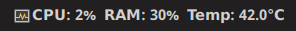

# CPU Dock Monitor

A simple, lightweight system tray indicator for Linux that displays real-time CPU usage, RAM usage, and CPU temperature. Built with Python, GTK3, and AppIndicator.



## Features

* 🖥️ Shows CPU usage, RAM usage, and temperature in your system tray
* 🔄 Updates every 2 seconds
* 🐧 Designed for GNOME and other Linux desktops supporting AppIndicator
* 🚀 Auto-starts on login (optional)
* 🪶 Minimal dependencies

## Requirements

* Python 3
* [psutil](https://pypi.org/project/psutil/)
* GTK 3 (`python3-gi`, `gir1.2-gtk-3.0`)
* AppIndicator 3 (`gir1.2-appindicator3-0.1`)
* `libgtk-3-dev` (for some systems)

## Installation

Run the provided install script:

```sh
chmod +x install.sh
./install.sh
```

This will:

* Install required dependencies
* Make the script executable
* Set up auto-start on login

## Uninstallation

To remove the indicator and its autostart entry, run:

```sh
chmod +x uninstall.sh
./uninstall.sh
```

## How it Works
The script uses the `psutil` library to gather system information and the `gi` library to create a GTK3 AppIndicator. It runs in the background and updates every 2 seconds.

## License
This project is licensed under the MIT License.

---
Made with ❤️ for Linux users.
